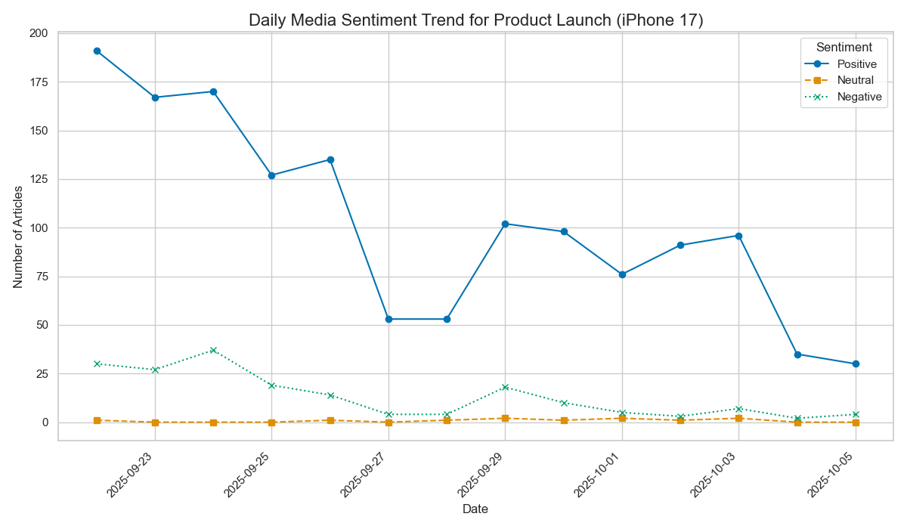

# Media Sentiment Analysis for Product Launch

In this project, I developed a **comprehensive pipeline** to `track`, `analyze`, and `visualize` media sentiment surrounding a product launch. By fetching **real-time news articles** from `NewsAPI.ai`, performing sentiment analysis, and generating trend visualizations, this toolkit offers valuable insights into public perception and the effectiveness of public relations campaigns.

## 📈 Final Output

The primary output of my analysis is a **time-series line chart** that visualizes the daily volume of news articles, categorized by sentiment (`Positive`, `Negative`, `Neutral`). This provides an at-a-glance understanding of how the media narrative evolves over time.

## 📋 Project Overview
In today's fast-paced media landscape, understanding the public's reaction to a new product is crucial. I designed this project to address the need for a real-time media monitoring solution. My primary objective was to build a proof-of-concept that could automatically:
- **Track** news coverage for a specific keyword (e.g., a product name).
- **Analyze** the sentiment of each news article.
- **Visualize** sentiment trends over a given period.

This approach allows stakeholders to **quantify the media's reaction** and **make data-driven decisions**. For example, one can answer questions like, "In the first 48 hours, what percentage of articles had a positive sentiment, and how did that change by day five?"

## 🛠️ Tech Stack & Dependencies
I built this project with Python 3 and leveraged several powerful data science and utility libraries:
- **Data Collection**: requests for making API calls to NewsAPI.ai.
- **Data Handling**: `pandas` for efficient data manipulation and structuring.
- **NLP/Sentiment Analysis**: `vaderSentiment` for fast and effective rule-based sentiment scoring.
- **Data Visualization**: `matplotlib` and `seaborn` for creating high-quality, informative plots.
- **Configuration Management**: `python-dotenv` for securely managing API keys.

## ⚙️ My Methodology

I structured the project as a **sequential pipeline**, with each script performing a distinct task.

### [1.Data Collection](1_collect_data.py)
This script connects to the NewsAPI.ai endpoint to fetch all English-language news articles related to the keyword **"iPhone 17"** within a specific date range. It handles pagination to retrieve a comprehensive dataset and saves the raw output as [raw_articles.json](raw_articles.json).

### [2. Sentiment Analysis](2_analyze_sentiment_VADER.py)

Using the raw data, this script processes each article's title and body. It employs the **VADER (Valence Aware Dictionary and sEntiment Reasoner)** library to calculate a 'compound' sentiment score for each article, which is then used to classify it as `Positive`, `Negative`, or `Neutral`. The enriched data is saved to [processed_articles_vader.csv](processed_articles_vader.csv).

### [3. Aggregation & Visualization](3_visualize_trends.py)

The final script reads the processed CSV file. Using `pandas`, it aggregates the data by counting the number of articles for each sentiment category per day. Finally, it uses `matplotlib` and `seaborn` to plot these daily counts on the line chart, which is saved as [sentiment_trend_chart.png](sentiment_trend_chart.png).

## 💡 Possible Next Steps
For future iterations of this project, I have several ideas for enhancements:
- **Advanced NLP Models**: I could integrate more sophisticated models like BERT or spaCy for more nuanced sentiment and entity recognition.
- **Interactive Dashboard**: A great next step would be to develop a web-based dashboard using Streamlit or Dash, allowing for dynamic filtering.
- **Topic Modeling**: It would be interesting to implement topic modeling (e.g., LDA) to discover key themes within the positive and negative article categories.
- **Expand Data Sources**: I could expand the analysis by incorporating data from social media platforms to get a more holistic view of public sentiment.